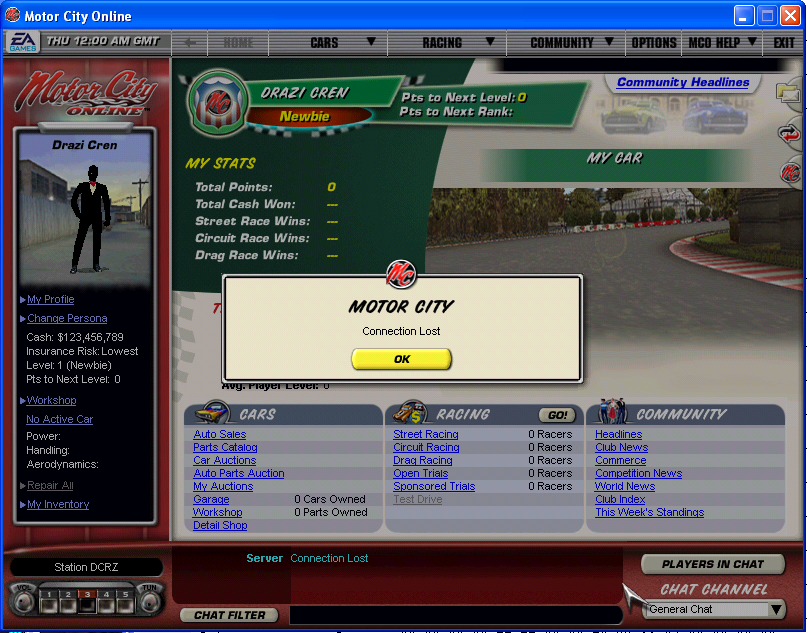

[](https://stand-with-ukraine.pp.ua)

# MCOS - Motor City Online Server

[](https://github.com/rustymotors/server/actions/workflows/node.yml) [](https://github.com/rustymotors/server/actions/workflows/codeql-analysis.yml?branch=dev) [](https://codecov.io/gh/rustymotors/server) [](https://coveralls.io/github/rustymotors/server?branch=dev)

> A from-scratch implementation of the server infrastructure for Motor City Online, a defunct online racing game. This project recreates the authentication, lobby, persona management, and game protocol handling required to run the original client.

## Features

- **Multi-Protocol Support** - NPS and MCOTS protocol handlers for full client compatibility
- **Complete Authentication** - Login, session management, and persona handling
- **Lobby System** - Game lobby with user lists and room management
- **Transaction Processing** - In-game transactions and race management
- **Session Recording** - Debug and replay socket traffic for testing

## Quick Start

### Prerequisites

- Node.js 20+ (use `nvm install && nvm use`)
- Docker (for PostgreSQL and services)
- Linux recommended (Windows XP client compatibility requires RSA-1024 certs)

### Installation

```bash
# Clone and install
git clone https://github.com/rustymotors/mcos.git
cd mcos
make install

# Start services and database
make up
make migration-up

# Generate SSL certificates (development only)
make certs

# Run the server
make start
```

For detailed configuration, see [Server Setup](docs/server.md).

## Architecture Overview

MCOS uses a **port-based routing architecture** where different game services listen on different TCP/UDP ports:

| Port | Service | Description |
|------|---------|-------------|
| 8226 | Login | Authentication and session management |
| 7003 | Lobby | Game lobby and user lists |
| 8228 | Persona | Character profiles |
| 43300 | MCOTS | Legacy transaction protocol |
| 3000 | Web | HTTP API for diagnostics |

```
Client --> Gateway --> Port Router --> Service Handler --> Database
                           |
                      MessageQueue (async processing)
```

For detailed architecture documentation, see [docs/architecture/MASTER_DESIGN.md](docs/architecture/MASTER_DESIGN.md).

## Project Structure

```
mcos/
├── libs/@rustymotors/    # Low-level technical libraries
│   ├── binary/           # Binary serialization primitives
│   ├── network/          # Network utilities
│   ├── parser/           # Protocol parsing
│   ├── protocol/         # Protocol definitions
│   └── rooms/            # Room management
│
├── packages/             # High-level domain services
│   ├── gateway/          # Server orchestration
│   ├── authentication/   # User authentication
│   ├── lobby/            # Lobby management
│   ├── transactions/     # Game transactions
│   └── shared/           # Cross-cutting utilities
│
├── src/                  # Entry points
│   ├── nps_server.ts     # Main server entry
│   └── chat/             # Chat functionality
│
└── docs/                 # Documentation
```

See [Package Structure Guide](docs/architecture/PACKAGE_STRUCTURE.md) for details on the `libs/` vs `packages/` organization.

## Documentation

- [Server Setup](docs/server.md) - Detailed server configuration
- [Client Setup](docs/client.md) - Client connection guide
- [Architecture](docs/architecture/MASTER_DESIGN.md) - Design decisions and patterns
- [Adding Handlers](docs/handlers/ADDING_HANDLERS.md) - Implementing new protocol handlers
- [Packet Serialization](docs/protocol/PACKET_SERIALIZATION.md) - Binary protocol format
- [Documentation Index](docs/README.md) - Full documentation listing

## Development

```bash
# Type checking
npm run check:all

# Linting and formatting
npm run lint:all
npm run format:all

# Run tests
npm test

# Run tests with coverage
npm run coverage

# Run session replay tests
npm run test:session
```

## Contributing

Contributions are welcome! This is a passion project reverse-engineering a long-dead game, and community help makes it possible.

- See [CONTRIBUTING.md](CONTRIBUTING.md) for guidelines
- Check [open issues](https://github.com/rustymotors/server/issues) for ways to help

## Timeline

| Date | Milestone |
|------|-----------|
| March 2016 | Project started |
| October 2023 | First successful lobby connection |
| January 2025 | Clean Code/SOLID refactoring complete |



## License

AGPL-3.0 - See [LICENSE](LICENSE)
