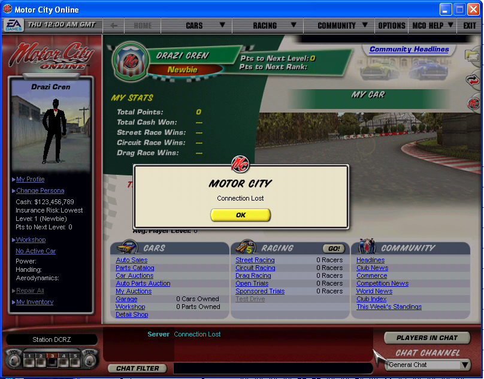

# mcos

This is a game server, being written from scratch, for a very old and long dead game. The owners of said game have shown no interest in bringing it back, but even so all names of their IP have been avoided to prevent issues.

     

## Help Wanted

I'm writing this from scratch. While I'm proud of what I've done, I'm hitting the point where I need help. Therefore, I'm open-sourcing this. Any assistance you can provide, either from code help, to suggestions, to even pointing out better ways to do things are greatly appreciated.

You can [contribute on GitHub](https://github.com/drazisil/mcos/contribute)

There's a brief explanation of the thought process here [link](https://github.com/drazisil/mcos/issues/164), and the [docs directory](./docs/) also contains some notes.

## Server Setup

-   See [server docs](./docs/server.md)

## Client Setup

-   See [client docs](./docs/client.md)

## Timeline

-   March 6, 2016 - Started

-   October 12, 2023 - Connected to lobby

## Current Status

-   [TODO Issues](https://github.com/drazisil/mcos/labels/todo%20%3Aspiral_notepad%3A)
